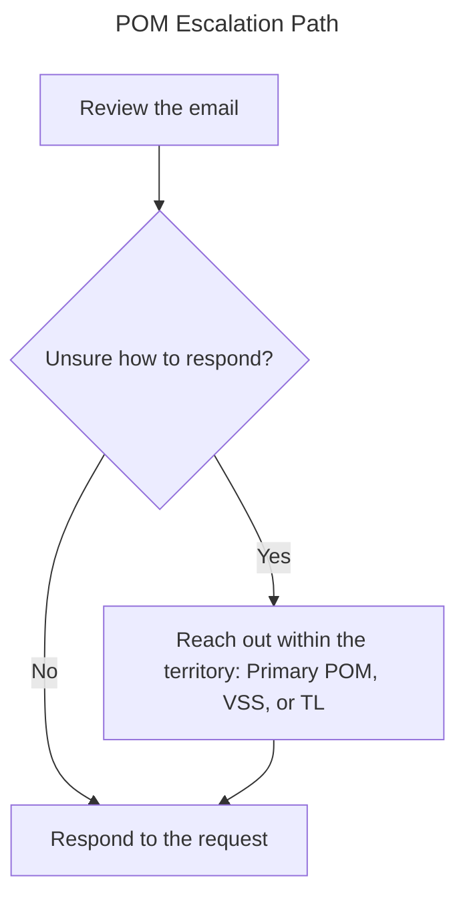

# Territory RC Management SOP

> Differences post-auto-triage in territory inbox management

**Primary POM**: 

**Secondary POM**: 

**VSS**:

---

## Overall Notes

- **Requests are still responded FIFO**
- **Nothing goes unanswered**

---

## Validating Auto-Triage

**Review the following information in the request before continuing**:
- Reseller & Reseller Contact
- Action Type (order, quote, etc.)
- Notes

*This information can be found in the attached `.eml` file*

---

### Reporting Errors

> "***What happens when auto-triage isn't correct?***"

>>> **This still needs validation**
- Reach out to the Copilot Agent and report your issue in plain language. Answer any follow-ups necessary.
- Nothing else!

---

## Working in Request Central

**All requests with the "Request Creator" set to something like: `idp_request_central` are tickets that have not been assigned yet. Look for the oldest request with this creator.**

1. Assign the correct person as both `Owner` and `Request Creator` for the request.
2. Validate the information through the `.eml` attachment
3. Begin work

---

## Email Filing & Responses

# Questions

- Should POMS be responding through RC Email function?
