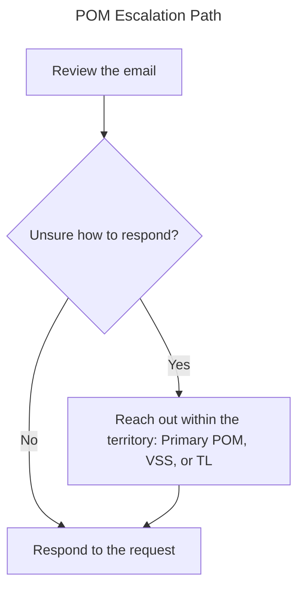

# Territory RC Management SOP

> Consolidated SOP — merges the original *Territory Inbox Management SOP* with the post-auto-triage changes.
> **Scope:** territory inbox management and Request Central (RC) work after auto-triage is in place.

---

## Roles

**Primary POM**: Main focus within the inbox is Request Central request/action creation and replying to partner emails.

**Secondary POM**: Main focus should be working requests, but should support the primary in the inbox when needed. Secondary POMs work as the primary in the event the primary is out of office.

**VSS**: Should assist with partner responses. Primary and secondary should reach out to the VSS for assistance when unsure how to respond to an email.

---

## Overall Notes

- **Requests are still responded to FIFO** (first in, first out).
- **Nothing goes unanswered** — everything that comes through the inbox receives a response.
- Communicate within teams to ensure we are working around each other's schedules and maintaining request coverage.

---

## Validating Auto-Triage

**Review the following information in the request before continuing:**

- Reseller & Reseller Contact
- Action Type (order, quote, etc.)
- Notes

*This information can be found in the attached `.eml` file.*

### Reporting Errors

> ***What happens when auto-triage isn't correct?***

> [!NOTE]
> **This still needs validation.**

1. Reach out to the Copilot Agent and report your issue in plain language. Answer any follow-ups necessary.
2. Nothing else!

---

## Working in Request Central

**All requests with the "Request Creator" set to something like `idp_request_central` are tickets that have not been assigned yet. Look for the oldest request with this creator.**

1. Assign the correct person as both `Owner` and `Request Creator` for the request.
2. Validate the information through the `.eml` attachment.
3. Begin work.

---

## Creating Requests

- Before updating a new request, search the Deal ID in CCW to verify the deal is in **"Approved"** status.
  - If the deal is **NOT** approved, do not create a request. Instead, reply to the partner asking them to inform us once the deal is approved.
- If there is an existing request, new actions should be added under that request.
- New requests should be created using the **Magic Button** or **CIS Plug In**.
  - You may need to change the name of the request if there is a new email thread.
  - If so, change it to the email subject stripped of any "FW:", "RE:", etc.
- Once a request has been created/added to workflow, send a response to the partner providing them with the RC request number.

---

## Email Filing & Responses

### Email Responses

- Understand what is needed before responding. Are they asking for a quote, or do they just need a question answered? Only create an RC request/action if a quote is needed — questions should be answered via ***Outlook***.
- Double check with your fellow POMs for clarity if you're unsure how to respond, and direct pricing questions to the VSS.

---

## Quick Blurbs

### Approval in Progress

> We are currently unable to quote Deal ID 000 as it is in "APPROVAL IN PROGRESS" status in CCW. We cannot apply discounts when the deal is in this state. Please let us know when the deal has been approved.
>
> For further assistance please contact your Cisco AM.

### Unable to View Deal

> At this time, we are unable to view Deal ID 000. Please ensure that all lines in CCW are set to TD SYNNEX CORPORATION and advise when the Deal has been approved for quoting.
>
> Should you have any questions, please feel free to contact us.

---

## Open Questions

- Should POMs be responding through the RC Email function?
- Confirm the error-reporting path for incorrect auto-triage (still pending validation).
